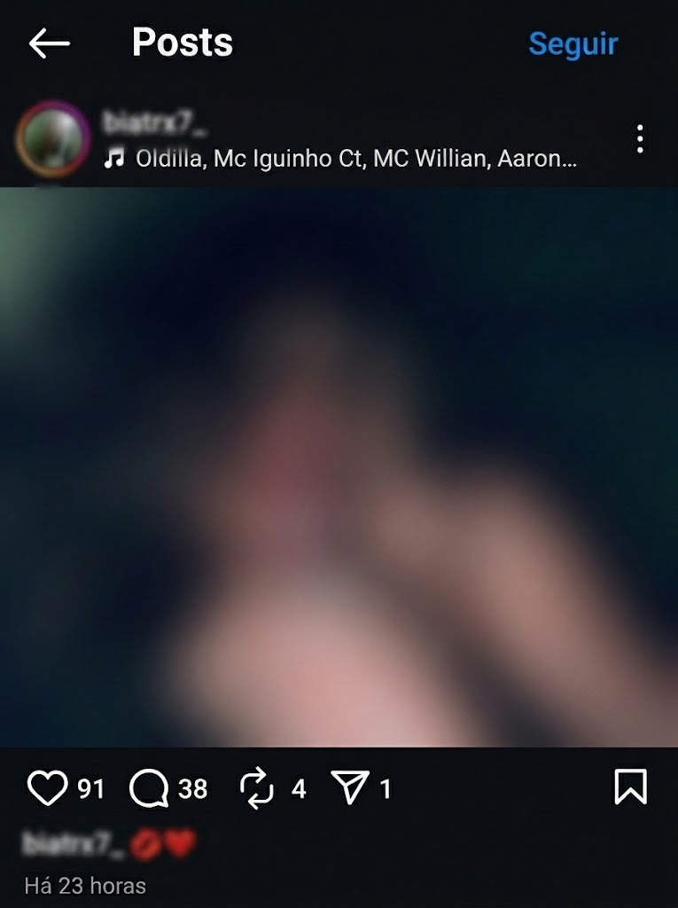
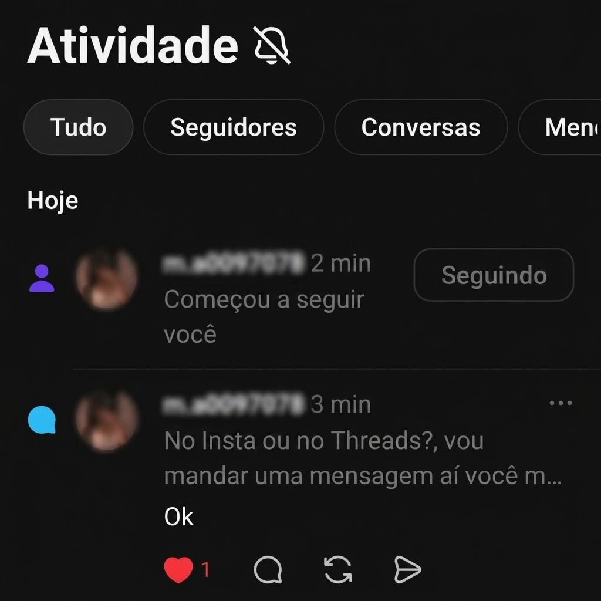

# 💋 `/namorar` — The Ultimate Dating & Seduction Skill for Claude

A custom Claude Skill that analyzes **descriptions of photos, screenshots, posts, reels, stories, or conversations** and generates strategic, psychology‑based conversation starters, follow‑ups, and relationship advice.

> **Note:** The Skill file is named **`namorar.skill`** (or **`namorar.md`**) and its instructions are written in **Portuguese** because it was originally created by a Brazilian author.  
> **Claude is multilingual** — the Skill works perfectly in **English, Spanish, French, German, Italian, Portuguese, and many other languages.**

---

## 🌍 Compatibility

| Aspect | Details |
|--------|---------|
| **Languages** | Any language supported by Claude (English, Spanish, Portuguese, French, German, Italian, etc.) |
| **Claude Models** | Haiku 4.5, Haiku 4.5 Extended, Sonnet 3.5, Opus 3.5 (all work) |
| **Platform** | Claude Web, Claude API, Claude Desktop, Claude Mobile |
| **Attachments** | Images, screenshots, PDFs (text extraction) |

---

## ⭐ Recommended Configuration

> [!IMPORTANT]
> For the **best results**:
> - Use **Claude Haiku 4.5** or **Claude Haiku 4.5 Extended**.
> - Enable **Extended Thinking (Deep Reasoning)** whenever available.
> - Always **describe the image** in text rather than relying solely on image analysis — this avoids Claude's safety filters.

---

## 💻 Installation

1. Download the Skill file:
   - 📄 **`namorar.skill`** *(recommended)*
   - 📄 **`namorar.md`** *(alternative)*

2. Go to Claude's Skills page:  
   🔗 [https://claude.ai/customize/skills](https://claude.ai/customize/skills)

3. Click **Create Skill**.

4. Upload the downloaded file.

5. **Save** the Skill.

> ✅ The Skill is now available in your Claude account. You can activate it by typing **`/namorar`** in any chat.

---

## 💬 How to Use

### Quick Start

| Step | Action |
|------|--------|
| 1️⃣ | Type **`/namorar`** in the chat |
| 2️⃣ | **Describe** the image, post, story, or conversation (or attach a file) |
| 3️⃣ | Specify your goal: *"Start a conversation"*, *"Reply to her story"*, *"Continue the chat"*, *"Get her to DM me"*, etc. |
| 4️⃣ | Claude generates **3 strategic message options**, each with a psychological justification. |

### What You Can Describe

- 📷 A photo (pose, outfit, background, expression)
- 💬 A conversation screenshot (what she said, the tone)
- 📸 An Instagram post (image + caption)
- 🎥 A Reel (what she's doing, the vibe)
- 📖 A Story (the context, the text, the setting)
- 🌐 Any online content you find interesting

---

## 🧠 How the Skill Works

The Skill is based on **Bruno Kraus's method** and **behavioral psychology**:

| Phase | Name | Mechanism | Neurochemical Target |
|-------|------|-----------|----------------------|
| **1** | **Dopamine Trigger** (Zeigarnik Effect) | An unfinished, intriguing statement that creates curiosity and makes her want to respond. | **Dopamine** — curiosity, obsession, anticipation |
| **2** | **Oxytocin Connection** (Cold Reading) | A deep observation about her personality with a playful contradiction, making her feel truly understood. | **Oxytocin** — bonding, trust, emotional connection |
| **3** | **Desire Spark** (Distorted Interpretation) | A playful, humorous twist on something she said or did, creating sexual tension without being explicit. | **Testosterone + Dopamine** — desire + anticipation |

---

## 📸 Example 1 — Starting a Conversation

| Image | Example Prompt |
|-------|----------------|
|  | `/namorar I found her on Threads. I want to start a conversation and convince her to DM me.` |

**Result:** Claude analyzes the image and your goal, then generates 3 strategic replies tailored to the situation.

---

## 💌 Example 2 — Continuing the Conversation

The Skill is **not limited to first messages**. You can keep using it throughout the conversation.

| Image | Example Prompt |
|-------|----------------|
|  | `/namorar She replied. What should I say now?` |

**Result:** Claude reads the latest screenshot, understands the flow, and generates a follow‑up that maintains continuity.

---

## 🔄 Typical Workflow

1. 🔍 Find a post, Reel, Story, or profile.
2. 💬 Use `/namorar` to generate an initial comment or first message.
3. ❤️ Receive a reply.
4. 📷 Continue using `/namorar` with updated screenshots or descriptions.
5. 💌 When the conversation moves from public comments to **DMs**, keep attaching the latest screenshot and continue using `/namorar`.
6. ✨ The Skill keeps generating natural follow‑ups that flow with the conversation.

> 💡 **Pro Tip:** If a screenshot contains a face, Claude may refuse to analyze it due to safety policies. In that case, simply **describe** the image in text (e.g., *"She's lying on a bed, black leggings, messy hair, smiling at the camera — the vibe is relaxed and flirty"*). The Skill works perfectly with text descriptions.

---

## 🚫 Limitations & Safety

| Issue | What happens | How to solve |
|-------|--------------|--------------|
| **Faces in images** | Claude may refuse to analyze images with identifiable faces | Describe the image in text instead of attaching it |
| **Explicit content** | Claude may refuse sexually explicit requests | Use suggestive, playful language instead of explicit terms |
| **Underage subjects** | Claude will refuse — always ensure you're interacting with adults | The Skill is designed for adult relationships only |

> **The Skill itself does not cause refusals — Claude's built‑in safety system does.** The Skill is designed to work around these limits by encouraging text descriptions when needed.

---

## 🛠️ Skill Features at a Glance

| Feature | Description |
|---------|-------------|
| **3‑Phase System** | Dopamine, Oxytocin, and Desire triggers |
| **9 Powerful Questions** | Based on Bruno Kraus's "infalible questions" to create deep emotional connection |
| **Dual Modes** | Solteiro (Single) and Relacionamento (Relationship) — adapts the tone |
| **Context‑Aware** | Understands public posts, DMs, stories, and long conversations |
| **Psychology‑Backed** | Grounded in Zeigarnik Effect, Cold Reading, and Neurochemistry |
| **No Generic Compliments** | Never uses "linda", "gostosa", or other clichés |

---

## 📜 License

This project is licensed under the **MIT License**.

You are free to:
- ✅ Use it commercially and personally
- ✅ Modify and adapt it
- ✅ Distribute it
- ✅ Include it in your own projects

All you need to do is retain the original copyright notice and license text.

See the [LICENSE](LICENSE) file for the full license text.

---

## ❓ FAQ

**Q: Does this Skill work in English?**  
A: Yes! Claude is multilingual. The Skill instructions are in Portuguese, but Claude understands them and generates replies in whatever language you're using.

**Q: Can I use this with Sonnet 3.5 or Opus?**  
A: Yes, but Haiku 4.5 Extended is recommended for the best balance of speed and reasoning.

**Q: What if Claude refuses to analyze an image?**  
A: Simply describe the image in text instead. The Skill works just as well (or better) with descriptions.

**Q: Does this Skill create explicit content?**  
A: No. It creates suggestive, playful, and confident messages — never explicit or vulgar.

**Q: Can I use this for long‑term relationships?**  
A: Yes! The Skill has a dedicated **Relacionamento (Relationship)** mode designed to maintain attraction and connection in established partnerships.

---

## 🤝 Contributing

Feel free to fork this repository, improve the Skill, and submit a pull request.  
If you have suggestions, open an issue or reach out.

---

## 🙏 Credits

- **Bruno Kraus** — Relationship coach and the inspiration behind the method.
- **Original Creator** — Brazilian author who developed and refined the Skill.

---

**👑 We're in this together!**  
Use this Skill wisely, respectfully, and always with consent.
