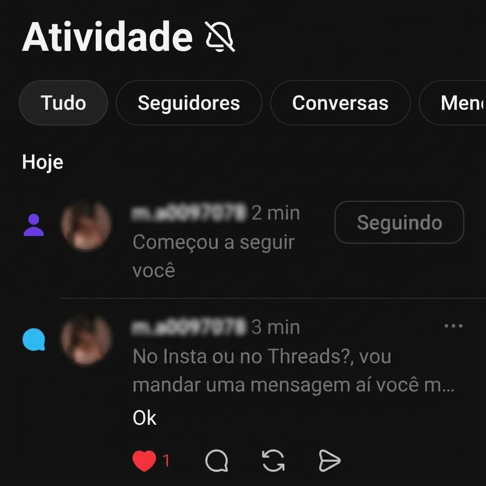

# 💋 `/namorar` — The Ultimate Dating & Seduction Skill for AI

A custom AI Skill that analyzes **photos, screenshots, posts, reels, stories, or conversations** and generates strategic, psychology‑based conversation starters, follow‑ups, and relationship advice.

> **Note:** The Skill file is named **`namorar.skill`** (or **`namorar.md`**) and its instructions are written in **Portuguese** because it was originally created by a Brazilian author.  
> **Claude is multilingual** — the Skill works perfectly in **English, Spanish, French, German, Italian, Portuguese, and many other languages.**

---

## 📥 Quick Download

| File | Download Link |
|------|---------------|
| **`namorar.skill`** (Recommended) | [⬇️ Download Latest](https://github.com/erikraft/flirting-skill/releases/latest/download/namorar.skill) |
| **`namorar.md`** (Alternative) | [⬇️ Download Latest](https://github.com/erikraft/flirting-skill/releases/latest/download/namorar.md) |

> 🔗 **Repository:** [github.com/erikraft/flirting-skill](https://github.com/erikraft/flirting-skill)

---

## 🌍 Compatibility

| Aspect | Details |
|--------|---------|
| **Languages** | Any language supported by the AI (English, Spanish, Portuguese, French, German, Italian, etc.) |
| **Claude Models** | Haiku 4.5, Haiku 4.5 Extended, Sonnet 3.5, Opus 3.5 |
| **Claude Code** | ✅ Works with Claude Code (via Skill import) |
| **Browser Agentic** | ✅ Works with Agentic browsers that support Skills |
| **Local Models** | ✅ Works with Ollama, Llama 3, Mistral, and other open‑source models |
| **Platforms** | Claude Web, Claude API, Claude Desktop, Claude Mobile |
| **Attachments** | Images, screenshots, PDFs (text extraction) — supports **Image Analysis** on compatible models |

---

## 🤖 Supported AI Platforms

| Platform | Type | Image Analysis | Skill Support | Tutorial |
|----------|------|----------------|---------------|----------|
| **Claude Web** | Cloud | ✅ Yes (via UI) | ✅ Native | [Tutorial](#-installation--claude-web) |
| **Claude Desktop** | Desktop App | ✅ Yes | ✅ Native | [Tutorial](#-installation--claude-desktop) |
| **Claude API** | API | ✅ Yes | ✅ Via prompt | [Tutorial](#-installation--claude-api) |
| **Claude Code** | CLI | ✅ Yes | ✅ Native | [Tutorial](#-installation--claude-code) |
| **LibreChat** | Self‑Hosted | ✅ Yes | ✅ Via prompt | [Tutorial](#-installation--librechat-selfhosted) |
| **Open WebUI** | Self‑Hosted | ✅ Yes | ✅ Via prompt | [Tutorial](#-installation--open-webui-local) |
| **Ollama + Open WebUI** | Local | ✅ Yes (LLaVA, Moondream) | ✅ Via prompt | [Tutorial](#-installation--ollama--open-webui-local-with-vision) |
| **LM Studio** | Local | ✅ Yes | ✅ Via prompt | [Tutorial](#-installation--lm-studio-local) |
| **GPT4All** | Local | ✅ Yes | ✅ Via prompt | [Tutorial](#-installation--gpt4all-local) |
| **Jan.ai** | Local | ✅ Yes | ✅ Via prompt | [Tutorial](#-installation--janai-local) |
| **KoboldCPP** | Local | ⚠️ Limited | ✅ Via prompt | [Tutorial](#-installation--koboldcpp-local) |
| **Agentic Browsers** | Browser | ✅ Yes | ✅ Custom | [Tutorial](#-installation--agentic-browsers) |

---

## ⭐ Recommended Configuration

> [!IMPORTANT]
> For the **best results**:
> - Use **Claude Haiku 4.5 Extended** for cloud‑based usage.
> - For local usage, use **Llama 3.2 Vision** or **LLaVA** with Open WebUI.
> - Enable **Extended Thinking (Deep Reasoning)** whenever available.
> - **For Image Analysis**, choose a platform that supports vision models (Claude, GPT‑4 Vision, LLaVA, or Moondream).

---

## 💻 Installation

### 🔷 Installation — Claude Web

1. Download the Skill file:
   - [⬇️ `namorar.skill` (Latest)](https://github.com/erikraft/flirting-skill/releases/latest/download/namorar.skill)

2. Go to Claude's Skills page:  
   🔗 [https://claude.ai/customize/skills](https://claude.ai/customize/skills)

3. Click **Create Skill**.

4. Upload the downloaded file.

5. **Save** the Skill.

> ✅ The Skill is now available. Activate it by typing **`/namorar`** in any chat.

---

### 🔷 Installation — Claude Desktop

1. Download the Skill file:
   - [⬇️ `namorar.skill` (Latest)](https://github.com/erikraft/flirting-skill/releases/latest/download/namorar.skill)

2. Open Claude Desktop.

3. Go to **Settings → Skills**.

4. Click **Import Skill**.

5. Upload the `.skill` file.

6. **Save** and restart Claude Desktop.

---

### 🔷 Installation — Claude Code

1. Clone the repository:
   ```bash
   git clone https://github.com/erikraft/flirting-skill.git
   cd flirting-skill
   ```

2. Copy the Skill to your Claude Code skills directory:
   ```bash
   cp namorar.skill ~/.claude/skills/
   ```

3. Or use it directly:
   ```bash
   claude code --skill namorar.skill
   ```

---

### 🔷 Installation — Claude API

1. Copy the contents of `namorar.md` into your system prompt.

2. Include it in your API request:
   ```python
   {
     "system": "=== SKILL: /namorar - SISTEMA DE SEDUÇÃO E RELACIONAMENTOS (v9.0) === ...",
     "messages": [...]
   }
   ```

---

### 🔷 Installation — LibreChat (Self‑Hosted)

1. Download: [⬇️ `namorar.md` (Latest)](https://github.com/erikraft/flirting-skill/releases/latest/download/namorar.md)

2. In LibreChat, go to **Settings → Custom Prompts**.

3. Paste the entire content of `namorar.md`.

4. Save as **System Prompt** and enable it.

5. Use it with **GPT‑4 Vision** or **Claude** models.

---

### 🔷 Installation — Open WebUI (Local)

1. Download: [⬇️ `namorar.md` (Latest)](https://github.com/erikraft/flirting-skill/releases/latest/download/namorar.md)

2. In Open WebUI, go to **Admin Panel → System Prompts**.

3. Create a **New System Prompt** named `namorar`.

4. Paste the content of `namorar.md`.

5. Save and **enable** it.

6. Use it with **Ollama** (Llama 3.2 Vision, LLaVA) or any compatible model.

---

### 🔷 Installation — Ollama + Open WebUI (Local with Vision)

1. **Install Ollama:**
   ```bash
   curl -fsSL https://ollama.com/install.sh | sh
   ```

2. **Pull a Vision Model (recommended):**
   ```bash
   ollama pull llava
   ollama pull moondream
   ```

3. **Install Open WebUI:**
   ```bash
   docker run -d -p 3000:8080 --name open-webui ghcr.io/open-webui/open-webui:main
   ```

4. **Add the Skill:**
   - Open Open WebUI → Admin Panel → System Prompts
   - Upload `namorar.md` content as a System Prompt

5. **Use:** Attach images and type `/namorar` — the vision model will analyze the image and the Skill will generate the response.

---

### 🔷 Installation — LM Studio (Local)

1. Download LM Studio from [lmstudio.ai](https://lmstudio.ai).

2. Download a Vision Model (e.g., LLaVA, Moondream).

3. Go to **Settings → System Prompts**.

4. Paste the `namorar.md` content as a System Prompt.

5. **Enable** the Skill and start chatting — the image analysis will be handled by the vision model.

---

### 🔷 Installation — GPT4All (Local)

1. Download GPT4All from [gpt4all.io](https://gpt4all.io).

2. Go to **Settings → Custom Instructions**.

3. Paste the `namorar.md` content.

4. **Save** and enable.

5. Use with any compatible model.

---

### 🔷 Installation — Jan.ai (Local)

1. Download Jan from [jan.ai](https://jan.ai).

2. Go to **Settings → System Prompt**.

3. Paste the `namorar.md` content.

4. **Save** and enable.

5. Use with **Jan Vision** models for image analysis.

---

### 🔷 Installation — KoboldCPP (Local)

1. Download KoboldCPP from [koboldcpp.com](https://koboldcpp.com).

2. Load a compatible model.

3. Go to **Settings → Custom System Prompt**.

4. Paste the `namorar.md` content.

5. **Enable** and use.

> ⚠️ **Note:** Image analysis is limited in KoboldCPP. Text‑based usage is recommended.

---

### 🔷 Installation — Agentic Browsers

Agentic browsers (like **Browser Use**, **Multi‑On**, **Jarvis**):

1. Download: [⬇️ `namorar.md` (Latest)](https://github.com/erikraft/flirting-skill/releases/latest/download/namorar.md)

2. Open your Agentic Browser's **Skill Manager**.

3. Upload or paste the Skill content.

4. **Enable** the Skill.

5. The Agentic Browser will use it automatically when analyzing posts, profiles, and conversations.

---

## 💬 How to Use

### Quick Start

| Step | Action |
|------|--------|
| 1️⃣ | Type **`/namorar`** in the chat |
| 2️⃣ | **Attach an image** (photo, post, story, screenshot) — on vision‑enabled models |
| 3️⃣ | Or **Describe** the image if the model doesn't support vision |
| 4️⃣ | Specify your goal: *"Start a conversation"*, *"Reply to her story"*, *"Continue the chat"*, *"Get her to DM me"* |
| 5️⃣ | The AI generates **3 strategic message options**, each with a psychological justification |

### What You Can Attach or Describe

- 📷 A photo (pose, outfit, background, expression)
- 💬 A conversation screenshot (what she said, the tone)
- 📸 An Instagram post (image + caption)
- 🎥 A Reel (what she's doing, the vibe)
- 📖 A Story (the context, the text, the setting)
- 🌐 Any online content you find interesting

---

## 🧠 How the Skill Works

The Skill is based on **Bruno Kraus's method** and **behavioral psychology**:

| Phase | Name | Mechanism | Neurochemical Target |
|-------|------|-----------|----------------------|
| **1** | **Dopamine Trigger** (Zeigarnik Effect) | An unfinished, intriguing statement that creates curiosity and makes her want to respond. | **Dopamine** — curiosity, obsession, anticipation |
| **2** | **Oxytocin Connection** (Cold Reading) | A deep observation about her personality with a playful contradiction, making her feel truly understood. | **Oxytocin** — bonding, trust, emotional connection |
| **3** | **Desire Spark** (Distorted Interpretation) | A playful, humorous twist on something she said or did, creating sexual tension without being explicit. | **Testosterone + Dopamine** — desire + anticipation |

---

## 📸 Example 1 — Starting a Conversation (with Image Analysis)

| Image | Example Prompt |
|-------|----------------|
|  | `/namorar I found her on Threads. I want to start a conversation and convince her to DM me.` |

**Result:** The AI analyzes the image, understands her vibe, posture, outfit, and setting — then generates 3 strategic replies tailored to the situation.

---

## 💌 Example 2 — Continuing the Conversation (with Screenshot)

The Skill is **not limited to first messages**. You can keep using it throughout the conversation.

| Image | Example Prompt |
|-------|----------------|
|  | `/namorar She replied. What should I say now?` |

**Result:** The AI reads the latest screenshot, understands the flow, and generates a follow‑up that maintains continuity.

---

## 🔄 Typical Workflow

1. 🔍 Find a post, Reel, Story, or profile.
2. 💬 Use `/namorar` to generate an initial comment or first message.
3. ❤️ Receive a reply.
4. 📷 Continue using `/namorar` with updated screenshots or descriptions.
5. 💌 When the conversation moves from public comments to **DMs**, keep attaching the latest screenshot and continue using `/namorar`.
6. ✨ The AI keeps generating natural follow‑ups that flow with the conversation.

> 💡 **Pro Tip:** If the AI cannot analyze the image (e.g., Claude's safety filter or non‑vision model), simply **describe** the image in text. Example: *"She's lying on a bed, black leggings, messy hair, smiling at the camera — the vibe is relaxed and flirty."* The Skill works perfectly with text descriptions too.

---

## 🚫 Limitations & Safety

| Issue | What happens | How to solve |
|-------|--------------|--------------|
| **Faces in images** | Some AI models may refuse to analyze images with identifiable faces | Describe the image in text instead of attaching it |
| **Explicit content** | AI may refuse sexually explicit requests | Use suggestive, playful language instead of explicit terms |
| **Underage subjects** | AI will refuse — always ensure you're interacting with adults | The Skill is designed for adult relationships only |
| **Non‑vision models** | Cannot analyze images | Use the text description method |

> **The Skill itself does not cause refusals — the AI's built‑in safety system does.** The Skill is designed to work around these limits by encouraging text descriptions when needed.

---

## 🛠️ Skill Features at a Glance

| Feature | Description |
|---------|-------------|
| **3‑Phase System** | Dopamine, Oxytocin, and Desire triggers |
| **9 Powerful Questions** | Based on Bruno Kraus's "infalible questions" to create deep emotional connection |
| **Dual Modes** | Solteiro (Single) and Relacionamento (Relationship) — adapts the tone |
| **Context‑Aware** | Understands public posts, DMs, stories, and long conversations |
| **Psychology‑Backed** | Grounded in Zeigarnik Effect, Cold Reading, and Neurochemistry |
| **No Generic Compliments** | Never uses "linda", "gostosa", or other clichés |
| **Image Analysis Ready** | Works with vision models for automatic analysis |
| **Cross‑Platform** | Works on Claude, Claude Code, Agentic Browsers, and Local Models |

---

## 📜 License

This project is licensed under the **MIT License**.

You are free to:
- ✅ Use it commercially and personally
- ✅ Modify and adapt it
- ✅ Distribute it
- ✅ Include it in your own projects

All you need to do is retain the original copyright notice and license text.

See the [LICENSE](LICENSE) file for the full license text.

---

## ❓ FAQ

**Q: Does this Skill work in English?**  
A: Yes! AI models are multilingual. The Skill instructions are in Portuguese, but the AI understands them and generates replies in whatever language you're using.

**Q: Can I use this with Claude Code or Agentic Browsers?**  
A: Yes! The Skill works with Claude Code, Browser Use, Multi‑On, and other agentic systems.

**Q: Can I run this locally on my computer?**  
A: Yes! Use Open WebUI + Ollama with a vision model like LLaVA or Moondream. See the tutorial above.

**Q: What if the AI refuses to analyze an image?**  
A: Simply describe the image in text instead. The Skill works just as well (or better) with descriptions.

**Q: Does this Skill create explicit content?**  
A: No. It creates suggestive, playful, and confident messages — never explicit or vulgar.

**Q: Can I use this for long‑term relationships?**  
A: Yes! The Skill has a dedicated **Relacionamento (Relationship)** mode designed to maintain attraction and connection in established partnerships.

**Q: Which local model works best?**  
A: **Llama 3.2 Vision**, **LLaVA**, or **Moondream** for vision tasks. For text‑only, **Llama 3.1 8B** or **Mistral 7B** work well.

**Q: How do I download the latest version?**  
A: Use the direct download links:  
- [⬇️ namorar.skill](https://github.com/erikraft/flirting-skill/releases/latest/download/namorar.skill)  
- [⬇️ namorar.md](https://github.com/erikraft/flirting-skill/releases/latest/download/namorar.md)

---

## 🤝 Contributing

Feel free to fork this repository, improve the Skill, and submit a pull request.  
If you have suggestions, open an issue or reach out.

---

## 🙏 Credits

- **Bruno Kraus** — Relationship coach and the inspiration behind the method.
- **[Original Creator](https://github.com/erikraft/)** — Brazilian author who developed and refined the Skill.

---

**👑 We're in this together!**  
Use this Skill wisely, respectfully, and always with consent.
